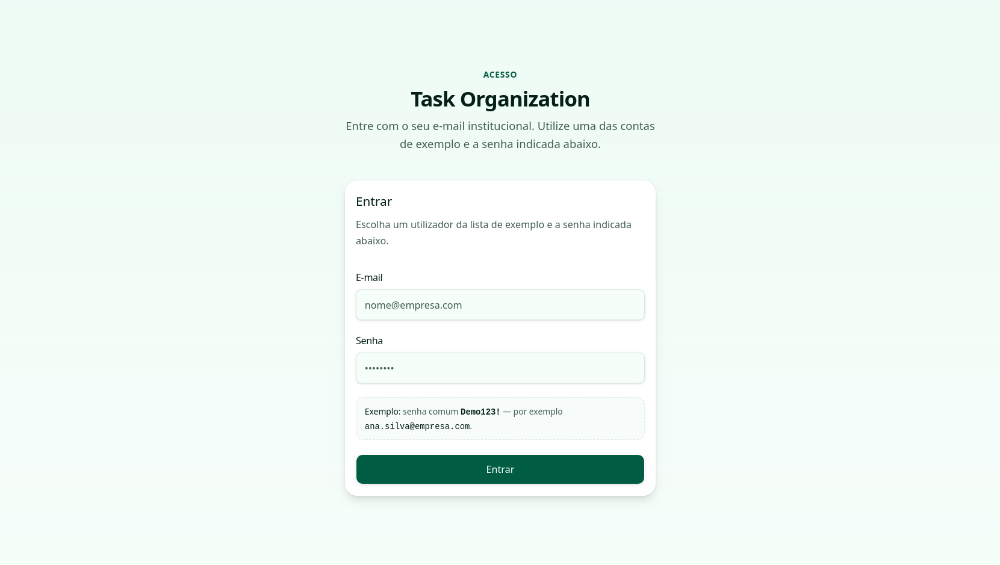
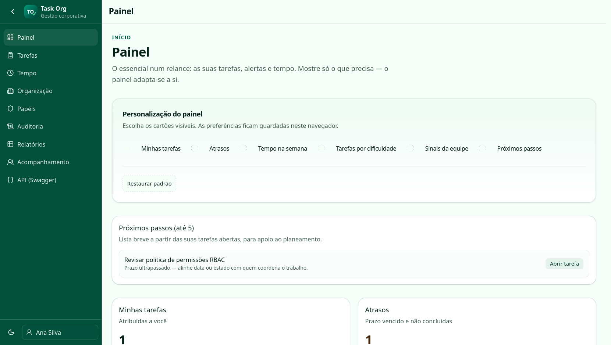

# Task Organization (frontend)





Demo: [task-organization.vercel.app](https://task-organization.vercel.app/)

SPA em **Vue 3**, **Vite**, **TypeScript**, **Pinia**, **Vue Router** e interface com **shadcn-vue** (Tailwind CSS v4). Paleta institucional: verde escuro `#006652`, amarelo `#ffc571`, verde claro `#5bdc9e` (tokens em `src/assets/globals.css`).

## Scripts

```bash
npm install
npm run dev      # desenvolvimento
npm run build    # build de produção
npm run preview  # pré-visualizar o build
```

## Variáveis de ambiente

Copie `.env.example` para `.env` e ajuste:

- `VITE_API_BASE_URL`: URL base da API ASP.NET (C#).
- `VITE_USE_MOCK`: `true` (padrão) usa dados e lógica no Pinia; `false` indica que o front deve consumir a API real (as stores ainda precisarão ser adaptadas para chamadas HTTP).

## Integração com o backend C#

- Cliente HTTP: `src/api/client.ts` (axios, header `Authorization: Bearer` a partir de `localStorage.auth_token`).
- Contratos de exemplo: `src/api/http/tasks.stub.ts` (ajuste rotas e DTOs ao contrato real).
- Tipos alinhados ao domínio: `src/types/index.ts`.

## Rotas

| Rota | Descrição | Permissão |
|------|-----------|-----------|
| `/login` | Seleção de usuário (demo) | — |
| `/` | Painel (widgets personalizáveis) | `tasks.read` |
| `/tasks` | Tarefas (lista + Kanban) | `tasks.read` |
| `/time` | Registro de tempo e totais | `time.read` |
| `/organization` | Diretorias, setores, usuários | `org.read` |
| `/admin/roles` | Papéis e matriz de permissões | `admin.roles` |
| `/reports` | Relatórios e export CSV | `reports.read` |

Permissões efetivas vêm dos papéis em `src/stores/roles.ts` e são verificadas em `src/composables/usePermissions.ts` e no guard em `src/router/index.ts`.

## Estrutura

- `src/stores/`: estado (auth, tarefas, tempo, organização, papéis, preferências).
- `src/views/`: páginas.
- `src/components/ui/`: componentes shadcn-vue.
- `src/components/tasks/` e `src/components/layout/`: componentes de domínio e shell.

## Ícones

Apenas **lucide-vue-next** (alinhado ao shadcn-vue).
